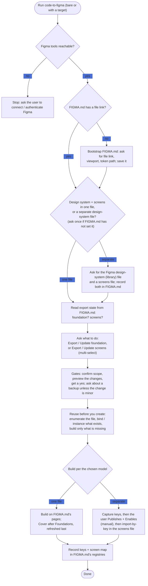

# code-to-figma (code -> design)

Pushing a screen or component FROM the codebase INTO the Figma file. This skill
carries the **gates, the build-from-the-system rule, and the plugin-API gotchas**;
it does not restate exact values. Every project-specific fact (Figma file key,
viewport, component and variable catalogue, naming) lives in FIGMA.md - read it first.

## Flow at a glance

Authoritative sources for this repo:

- **FIGMA.md** - the project's full Figma guide (`FIGMA.md`, repo root): file key(s),
viewport, file structure, component and variable catalogue, naming, and the
code <-> Figma workflow. **Open it before acting.** It is the project cartridge
this generic skill reads from; if a fact you need is missing, add it there.
- **The brand/design contract** FIGMA.md links (palette, gradients, type, motion,
radii, and the decision changelog). Log design decisions there.
- **The project's design-token CSS** (see FIGMA.md for the path) - the source of
truth for token *values*. Edit values there and reflect them into Figma; never
hand-edit divergent values into Figma.
- **CLAUDE.md** - the short version of the repo's rules.

---

## Preconditions - the docs this skill relies on

Before the intake or any write, confirm the docs the skill reads actually exist. Do not guess around a
missing one.

- **Preflight: are the Figma tools reachable?** Before any read or write, confirm the Figma MCP tools
respond with a lightweight call (`whoami`, or a `get_metadata` on the file). If they error, the Figma
plugin/server is not connected or not authenticated (also the case in headless/cron runs), or the
desktop file is not open - stop and tell the user how to connect rather than limping forward. Treat a
stale/invalid file key or "file not found / no access" the same way: surface it, do not guess another key.
- **FIGMA.md missing.** There is no cartridge, so nothing project-specific to read (no Figma file, no
token path, no catalogue). Do not proceed blind: offer to bootstrap a minimal FIGMA.md - ask the user
for the Figma file link/key, the viewport, and the path to the design-token CSS (plus the design docs it
links, if any), write those into a new `FIGMA.md` at the repo root, then continue. Never invent a key,
viewport, or path.
- **DESIGN.md (or whatever token spec FIGMA.md links) missing.** Not blocking. Token *values* live in the
code (the token CSS is the source of truth), so read them straight from there. Note the doc is absent and
offer to (re)generate it from the tokens; do not block the export on it.
- **The token CSS itself missing, or FIGMA.md's path to it is wrong.** Ask the user for the correct path
and fix it in FIGMA.md; never hardcode values to work around it.

---

## Running with just `/code-to-figma` (no target given)

Invoked bare - no screen, component, or instruction to act on - run this intake first. The explicit
invocation clears Gate 0; this flow is how Gate 1 (scope) gets settled.

**Step 1 - make sure the cartridge and a target file exist.** Read FIGMA.md. If FIGMA.md does not exist,
bootstrap it first (see Preconditions above). If it exists but records no Figma file
link/key, stop and ask the user for the file URL (a plain question, never a guess). Once given, add it
to FIGMA.md so it persists (a doc edit, not a Figma write), then continue. If FIGMA.md records more than
one Figma file (for example a mobile file and a web file, or a published design-system library separate
from a screens file), ask which file this action targets before continuing; for a published-library +
screens-file split, follow "Cross-file: published library" below.

**Step 1b - settle the file model** (only if FIGMA.md has not already recorded it). Ask the user whether
to keep the **design system and screens in one file** (the default) or the **design system in a separate
published library file** plus a separate screens file. If they choose separate, ask for the Figma
**design-system (library) file** link and the **screens file** link, record both in FIGMA.md's "Files, keys, and the screen map", and follow "Cross-file: published library" below. Once recorded, later runs follow the
model without re-asking.

**Step 2 - read the export state from FIGMA.md.** FIGMA.md is the ledger of what has already been
pushed to Figma. From it, determine:

- **Foundation** - is the design system (its Variable collections / styles / core components) already
in the file, and is it complete and current? FIGMA.md flags pieces that exist in the design system
but are not yet mirrored (a mode, a tone, a component) and notes when values have drifted - that is
your "partial" signal.
- **Screens** - are any screens listed as exported?

**Step 3 - ask what to do** (`AskUserQuestion`, single select). Assemble the option set from the
state; offer only what applies:

| Foundation state (per FIGMA.md)    | Foundation option(s) to offer                                                                                                           |
| ---------------------------------- | --------------------------------------------------------------------------------------------------------------------------------------- |
| not in the file at all             | **Export foundation** - build the Variables / styles / components fresh                                                                 |
| fully in the file, current         | **Update foundation** - re-sync the existing tokens / styles / components to current values                                             |
| in the file but partial or drifted | **both**: **Update foundation** (refresh what is there) and **Export foundation additions** (push the documented-but-unmirrored pieces) |

Always also offer, alongside the foundation option(s):

- **Export screen(s)** - build one or more screen frames from the system.
- **Update screen(s)** - only if FIGMA.md shows screens already exported.

**Step 4 - branch on the answer:**

- **Foundation (export / update / additions)** -> load `figma-generate-library` + `figma-use`. First
enumerate what the file already holds and reuse it (see "Reuse before you create" below); then build or
refresh only the Variable collections, styles, and components that are missing or drifted, per FIGMA.md's
catalogue and the token spec it links. **Record what you exported back into FIGMA.md** so the next run
can tell.
- **Screen(s)** -> if the foundation is not in the file yet, say so first (screens are built from
components per the #1 rule; offer to export the foundation first). Then present the candidate screens as a
**multi-select** checklist (`AskUserQuestion` with `multiSelect: true`, the same as Gate 1) so the user can
pick one or several at once, and build/update each ticked screen per "Build / update a frame" below.

Then continue through the Gates for the write itself.

---

## Gates - clear these IN ORDER before any Figma write

**Gate 0 - never touch the Figma file unprompted.** A request to change *code* is
**not** permission to write to Figma. Even when syncing code -> Figma looks like the
obvious next step, do only what was asked, then *offer* to sync and **wait for an
explicit yes**.

**Gate 1 - ask which frames, never assume "all".** Once a sync is approved, present
the candidate frames as a multi-select checklist (`AskUserQuestion` with
`multiSelect: true`) and update only the ticked ones. Then, before writing, summarize the concrete
changes you are about to make (which frames/nodes, and what changes on each) and get a yes - never apply
a blind diff.

**Gate 2 - back up unless the change is minor.** For each selected frame, judge the
size of the change and act on that:

- **Minor change** - a surgical patch that does not reshape the frame (a copy tweak,
  a colour/token swap, an icon, a spacing nudge). Go **direct, no backup**.
- **Anything else** - any change beyond a minor patch (a restructure, a section
  added or removed, a layout reflow, a major redesign). **Ask whether to copy the old
  frame to a backup/archive page** in the same file *before* editing, and wait for the
  answer.

When unsure which bucket a change falls in, treat it as "anything else" and ask.

---

## The #1 rule: build from the system, never raw values

This is the most-repeated correction, and it cuts both ways: build *from* the system, and
**reuse the system that is already there**.

**Reuse before you create.** The foundations and components already in the Figma file (Variable
collections, paint/effect/text/grid styles, and the component set) are what you build with - never
duplicate one. Before exporting anything, enumerate what the file already holds (`get_variable_defs`,
`get_metadata`, `search_design_system`, or a read-only `use_figma` pass), match what you are about to
push against it, and create only what is genuinely missing. A second `--accent` variable, a duplicated
Button, or a re-drawn icon is exactly the failure this prevents: a token that already exists gets
*bound*, a component that already exists gets *instanced*, and a style that already exists gets
*applied* - none get remade.

**Removals and renames are not silent.** On a foundation update, a token, style, or component that no
longer exists in code is an orphan in Figma - report it and let the user decide; never auto-delete. A
token or component that was *renamed* in code is renamed in place in Figma (rename the existing node so
its bindings survive), never delete-and-recreate. List any Figma nodes that no longer map to code.

**Foundations holds specimens, component pages hold components - the node type decides, not the vibe.**
A `COMPONENT` or `COMPONENT_SET` belongs on a **component page**, always. The foundations page holds only
non-component specimens: swatch boards, the type ramp, spacing/radius/size/elevation/motion boards - things
that **document** a value rather than being an instanceable asset. "It feels foundational", "it is atomic",
and "everything swaps it in" are **not** the test. An icon set is the trap this rule exists for: icons feel
like a foundation, but they are components (INSTANCE_SWAP targets for buttons, chips, nav items), so a large
atomic family is still a family and gets **its own page** in the components block - and being the most
atomic, it belongs at the *top* of that block, not appended at the end.

Two corollaries:

- **On a foundation update, audit before you add.** If a component family is sitting on the foundations
page, do not add to it in place - **flag it and offer to move it to its own page**. A page move is cheap and
safe: a component's `key` is intrinsic to the component, **not** its page, so the move preserves every
recorded key, keeps in-file INSTANCE_SWAP references resolving, and leaves existing instances linked. It
does **not** dirty the published library either - verified 2026-07-28 on the 51-icon move, where
`getPublishStatusAsync()` still read `CURRENT` on the moved components afterwards, so **no re-publish is
required for a move alone**. (Do re-check this rather than assuming; a content edit in the same run is what
flips a component to `CHANGED`.)
- **Record the page.** When a family gets or changes its page, name that page in the key registry
`design/figma-library-keys.md` and in FIGMA.md's File structure, so the next run builds against the real
shape instead of re-creating the old one.

**A misnamed frame is a defect - fix it, don't document around it.** Whenever a run takes you past a
screen frame whose name is wrong (it describes a different screen, carries a meaningless ordinal, or
predates the current convention), rename it in place on that run and say so in the summary. Renames are
free, survive bindings, and leave node-ids untouched, so there is no reason to defer one. The
anti-pattern to refuse: adding a "match this row by node-id, not by name, the name lies" warning to the
screen map and moving on. That leaves the map's own name-fallback rule quietly broken for every later
run, and the warning outlives the two minutes the rename would have cost. Renaming is **not** a "minor vs
major" gate-2 judgement (it reshapes nothing) - but a **bulk** rename across a page is still a change the
user should see listed before you write it.

Every screen or element you create must be:

- **Component instances** wherever a component exists (buttons, inputs, cards, chips,
rows, tab bar, the icon set, logos, and so on - full catalogue in FIGMA.md). Do not
redraw what a component already does.
- **Bound to variables** for colour (`setBoundVariableForPaint`), and for
spacing/padding/gap and corner radii (`setBoundVariable`).
- **Styled with paint / effect / text styles** (`setFillStyleIdAsync`,
`setEffectStyleIdAsync`, `setTextStyleIdAsync`).

Hardcoded hex/px is acceptable only for genuine one-offs the tokens do not cover -
and say so when you do it.

---

## Fonts that cannot load in the MCP context - a permanent invariant, not a bug

A product display or brand font may be installed only on the **user's machine** and
be **unable to load in the Figma MCP/server context** (`listAvailableFontsAsync`
returns none). See FIGMA.md's font note for which face this applies to here. When it
does:

- **Creating/editing text in that face:** set `characters` with a loadable font
(a system face such as a Roboto/Inter/Arial-class font) first, do all layout writes
(`textAutoResize`, `layoutSizing*`, fills) while still on the loadable font, then
**apply the target text style LAST** (`setTextStyleIdAsync`). Any write *after* the
unloaded-font style throws `Cannot write to node with unloaded font "..."`.
- MCP screenshots render that text in a fallback (small/lowercase/boxes). It looks
correct in the user's Figma. **Mention this once at most; do not keep flagging it.**

---

## Plugin API gotchas (`use_figma`)

- **`resize()` resets auto-layout sizing modes to FIXED.** Set hug/fill sizing *after*
`resize()`/`appendChild`, or re-assert `primaryAxisSizingMode = "AUTO"` afterward.
Symptom: a frame collapses to ~10px. The device viewport frame *should* stay FIXED.
- **`layoutSizingHorizontal/Vertical = "FILL"/"HUG"` only works after the node is
appended** to an auto-layout parent. Append first, then set sizing.
- **Component overrides:** components that expose TEXT props take
`instance.setProperties({...})`. Where a component's texts are *not* props, override
the nested text nodes' `characters` directly (and set an optional helper/subtext node
`visible = false` when there is no hint).
- **Logos/icons:** import SVGs with `createNodeFromSvg` (strip XML/DOCTYPE, give explicit
width/height), then `createComponentFromNode`. Do not rebuild from primitives. Discover
node IDs at runtime (`get_metadata` / read-only `use_figma`) - do not hardcode them.
- **Effects the design system defines (blur, shadow, frosted/translucent surfaces):**
first reach for the existing component or **effect style** and instance/bind it. If no
component covers that element, render a **simple approximation** - a translucent
token-bound fill plus a single bound effect - and note the simplification. Do **not**
hand-stack pseudo-element layers or SVG filter displacement into Figma; that produces a
buggy mess.
- **Work incrementally:** <= ~10 logical ops per `use_figma` call, build one section/screen
per call, return created node IDs, and validate with `get_screenshot` / `get_metadata`
between steps. Scripts are atomic - a failed script changes nothing.
- **Load the prerequisite skills first** (pass via `skillNames`): `figma-use` before any
`use_figma` call; add `figma-generate-design` when building screens.
- **Viewing screenshots:** `get_screenshot` returns a URL - `curl` it to a temp file and
`Read` the PNG. Use `get_variable_defs` on a node to confirm token bindings.
- **File rename is not possible via the API** (`figma.root.name = ...` throws). Do the
in-file work programmatically; tell the user the file rename itself is a manual step
(double-click the title in the Figma toolbar).
- **Publishing / enabling a library is manual, at every plan tier** (no Plugin or REST API - like file
rename). The plugin can *read* publish state (`getPublishStatusAsync` -> `CURRENT` / `CHANGED` /
`UNPUBLISHED`) but cannot publish, and cannot enable a library in a consuming file. **Consuming** a
published library IS scriptable by key (`importComponentByKeyAsync` / `importComponentSetByKeyAsync` /
`importStyleByKeyAsync` / `figma.variables.importVariableByKeyAsync`; the `figma.teamLibrary.*` methods
need the `teamlibrary` manifest permission). You cannot enumerate a library's published
components/styles - keys must be known. Full flow in the cross-file section below.

---

## Build / update a frame

1. Clear the **gates** above first.
2. Load `figma-generate-design` + `figma-use`.
3. Instance components and bind tokens per the #1 rule.
4. **Pages/layout:** follow FIGMA.md's File structure and its fixed page order (a foundations page, one
 page per component family, a screens page, an archive/backup page, and a cover). Put each screen on
 the screens page, named per step 5, at the documented viewport, adding new feature sections as new
 rows on the documented pitch. Build and populate the **Cover** per FIGMA.md's cover rule (leave it
 empty until the foundation exists, then refresh it as the last step of a full export). Do not invent
 pages outside that structure. **Which page a node belongs on is decided by its node type - see
 "Foundations holds specimens, components hold components" below.**
5. **Name the frame - from FIGMA.md's screen-frame convention, never ad hoc.** Read that convention
 (naming section) *before* creating the frame and follow its casing and its `screen[-theme][-state]`-style
 shape exactly. Three rules that hold whatever the convention says:
   - **The name describes what the frame renders**, not the flow position, the capture order, or what sat
   next to it on the canvas. A trailing digit is for a genuine duplicate of the same screen only - never
   to disambiguate two different screens (the "Sign in" / "Sign in 2" pair that turned out to be Splash +
   Sign in is the failure this prevents).
   - **A rename is free and does not change a node-id.** Renaming a frame costs nothing, breaks no
   binding, and invalidates no recorded id - so when you pass a frame whose name does not match its
   content, **fix it in place** and note it, rather than working around it or adding a warning to the map.
   - **If FIGMA.md documents no convention yet, stop and propose one**, get the user's yes, then write it
   into FIGMA.md's naming section *before* you name frames by it. Do not leave the convention implicit in
   the canvas.
6. **Screen scaffold:** background from the documented canvas/gradient paint style; vertical
 auto-layout; padding/gaps bound to the spacing tokens; primary CTAs are the button
 component at FILL width. Follow FIGMA.md for header/section spacing.
7. **Record the screen mapping:** once a screen frame exists, record its **frame name** *and* Figma
**frame node-id** + code path in the screen map `design/figma-screen-keys.md` (a fixed name; FIGMA.md links
it) so `figma-to-code` can find the exact frame and target the right code file on the return trip. Record
the name, not just the id: the id is the fast path, the name is the **fallback** `figma-to-code` uses when a
frame has been recreated, and a map that omits it leaves that fallback guessing.

---

## Cross-file: published library + a separate screens file (advanced)

**Default is one file** - Foundations, Components, and Screens live together (see FIGMA.md's File
structure), screens instance local components, and nothing here needs a library. Use this section only
when FIGMA.md defines a **split**: a published **library file** (Foundations + Components + Cover) and a
separate **screens file** that consumes it.

The hard constraint: **publishing and enabling a library are manual, human-only steps at every plan tier** -
there is no publish API, and no API to enable a library in a consuming file. The skill builds and
consumes; a person publishes and enables.

1. **Build the DS in the library file** - Foundations + component-family pages + Cover, exactly as in
 "Build / update a frame". Screens do NOT go here in the split model.
2. **Capture keys.** As you create/update each component, component set, style, and variable, read its
 `.key` and record it in the published-key registry `design/figma-library-keys.md` (a fixed name; FIGMA.md's "Files, keys, and the screen map"
section names it). Required: a consuming file **cannot enumerate** a
 library's published components/styles, so the keys must be captured now or the screens file can never
 import them.
3. **Publish handshake (manual gate).** Check `getPublishStatusAsync()` on the DS nodes; if any read
 `UNPUBLISHED` or `CHANGED`, stop and ask the user to publish the library (Assets panel -> Publish;
 needs a paid plan + Full seat). Wait for confirmation, then re-check. You cannot publish for them.
4. **Enable handshake (manual gate).** In the screens file, check whether the library is enabled
 (`figma.teamLibrary.getAvailableLibraryVariableCollectionsAsync()` lists enabled libraries; for
 components/styles, attempt an import-by-key and catch the rejection). If it is not enabled, ask the
 user to enable it in the Libraries dialog and wait. You cannot enable it for them.
5. **Consume in the screens file.** With the library published + enabled and the keys from step 2:
 `figma.importComponentByKeyAsync(key).createInstance()`, `figma.importStyleByKeyAsync(key)`,
 `figma.variables.importVariableByKeyAsync(key)` and bind. Build screens from these imported instances
 (the #1 rule still holds - instance and bind, never redraw).
6. **Re-sync after a DS change.** Rebuild in the library file and capture any new keys, then ask the user
 to **re-publish**. Existing keys persist across a republish, so **Figma's own library sync updates the
 screens file's instances automatically** once published - the skill does not (and need not) touch the
 screens file for existing assets. Return to the screens file only to import genuinely **new** keys.

---

## Direction of truth, drift, and the sync marker

- **Code is the value source of truth; Figma is exploration** (FIGMA.md section 8). When a value differs
between code and Figma, code wins for token *values* unless the user says otherwise.
- **On a genuine conflict** (both sides changed the same thing since the last sync), do not silently
overwrite - flag it and let the user choose.
- **Record what you pushed.** After a successful export, update the two fixed registries: library asset
keys in **`design/figma-library-keys.md`**, and each exported screen's **frame name + frame node-id + code
path** in
**`design/figma-screen-keys.md`**. **Stamp each row's Status / Last updated (sync state + date)** as you add or re-verify it, and
flag a row whose asset is gone (an orphan) rather than deleting it silently. That is what lets the next run
and figma-to-code find things instead of blind-diffing. **Renames count as something you pushed** - if the
run renamed any frame, list the old -> new pairs in the summary and re-stamp those rows.

## Failure, concurrency, and scale

- **A multi-call build is not atomic** even though each `use_figma` script is. Track the node IDs each
call returns; if a later call fails, resume from there or report exactly what is half-built - do not
restart from scratch and duplicate.
- **The user may be editing the file** while you write. Re-read (`get_metadata`) right before a write, and
if a target node changed under you, pause and confirm.
- **Naming collisions:** if a frame or component of that name already exists, match-and-update it rather
than making a second one - ask if it is ambiguous.
- **Rate limits / transient API errors:** back off and resume from the last returned node IDs; do not
restart the whole job.
- **Large jobs** (a whole foundation, or many screens) run over many calls - confirm the scope first,
work in checkpoints, and report progress.

## Known limits

- A Figma frame is a **static, single-theme** picture. The code ships dark, RTL, motion, and interaction
states; those do **not** round-trip - do not try to encode dark mode, RTL mirroring, or animation into a
frame. Export the one theme the file holds and say so.
- **Empty / first-time project** (no tokens yet, or nothing in Figma yet): the first export builds the
whole system, which is large - confirm scope and checkpoint.
- **Non-visual change:** if what changed in code has no design representation (data, logic), say there is
nothing to mirror rather than inventing a frame.

## Pointers

- Full guide and project specifics: **FIGMA.md**. Brand contract, palette, motion: the
design docs FIGMA.md links. Short version of the rules: **CLAUDE.md**.
- Reading a design into code (Figma -> code): the **figma-to-code** skill.

