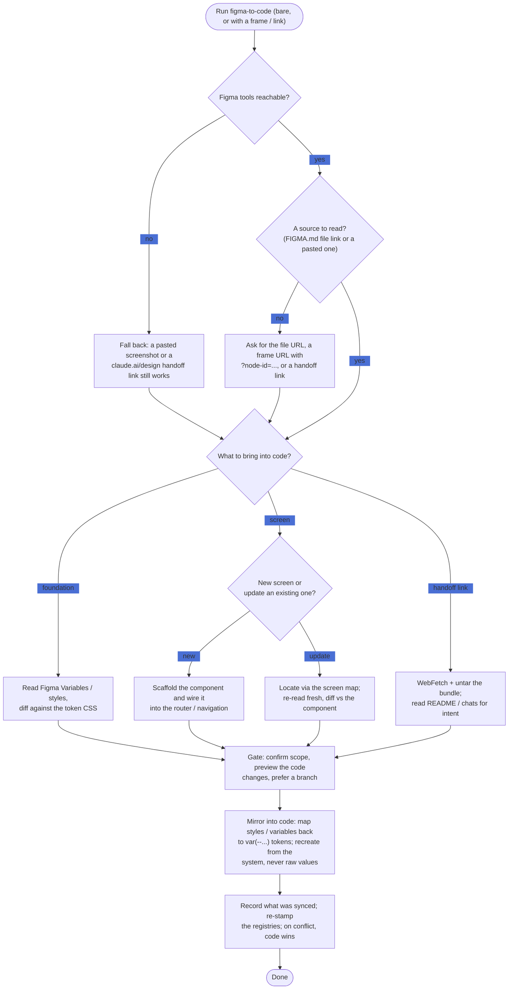

# figma-to-code (design -> code)

Bringing a design INTO the codebase. This skill carries the **read/sync
procedure and its traps**; it does not restate exact values. Every project-specific
fact (Figma file key, viewport, component and variable catalogue, token paths) lives
in FIGMA.md - read it first.

## Flow at a glance

Authoritative sources for this repo:

- **FIGMA.md** - the project's full Figma guide (`FIGMA.md`, repo root): file key(s),
  viewport, file structure, and the component and variable catalogue. **Open it before
  acting.** It is the project cartridge this generic skill reads from; if a fact you
  need is missing, add it there.
- **The brand/design contract** FIGMA.md links (palette, gradients, type, motion,
  radii, and the decision changelog).
- **The project's design-token CSS** (see FIGMA.md for the path) - the source of truth
  for all token *values*.
- **CLAUDE.md** - the short version of the repo's rules.

> Reading Figma is safe; **writing** to it is gated and belongs to the
> **code-to-figma** skill. This skill never edits the Figma file.

---

## Preconditions - the docs this skill relies on

Before the intake or any sync, confirm the docs the skill reads actually exist.

- **Preflight: are the Figma tools reachable?** Before reading anything, confirm the Figma MCP tools
  respond with a lightweight call (`whoami`, or a `get_metadata` on the file). If they error, the Figma
  plugin/server is not connected or not authenticated (also the case in headless/cron runs), or the
  desktop file is not open - stop and tell the user how to connect. Treat a stale/invalid file key or
  "file not found / no access" the same way. A pasted screenshot or a handoff link is the fallback when
  the live file cannot be reached.
- **FIGMA.md missing.** The cartridge that names the Figma file and the token paths is gone. You can still
  act on a link the user pastes directly (a Figma file/frame URL, or a claude.ai/design handoff link), but
  offer to bootstrap a minimal FIGMA.md - ask for the Figma file link/key, the viewport, and the token-CSS
  path - and write it so the next run has a cartridge. Never invent a key or path.
- **DESIGN.md (or whatever token spec FIGMA.md links) missing.** Not blocking for design -> code: write the
  reconciled values into the token CSS (the source of truth). Offer to (re)generate DESIGN.md from the tokens
  afterward.
- **The token CSS itself missing, or FIGMA.md's path to it is wrong.** Ask the user for the correct path and
  fix it in FIGMA.md before mirroring values in.

---

## Running with just `/figma-to-code` (no target given)

Invoked bare - no frame, link, or instruction - run this intake first.

**Step 1 - make sure there is something to read.** Read FIGMA.md. If FIGMA.md does not exist, bootstrap it
(see Preconditions above) or proceed from a link the user pastes. If it exists but records no Figma file link/key,
ask the user for it: the file URL, a frame URL with `?node-id=...`, or a claude.ai/design handoff link.
If they give a Figma file link, add it to FIGMA.md so it persists (a doc edit). If FIGMA.md records more
than one Figma file (for example a mobile file and a web file, or a published library separate from a
screens file), ask which file to read from before continuing. The design system may live in a separate
published **library file** - read it directly by its file key (reading a library file is the same as
reading any file); the screen and handoff procedures below are unchanged.

**Step 2 - ask what to bring into code** (`AskUserQuestion`, single select):
- **Sync the design-system foundation** - reconcile the Figma Variables / styles into the code tokens
  and the token spec FIGMA.md links (design -> code for the foundation).
- **Implement / sync a specific screen** - pull one Figma frame into the codebase's components.
- **Process a claude.ai/design handoff link** - the separate tarball pipeline; offer this when the user
  has a handoff link rather than a Figma frame.

Tailor by what FIGMA.md records: if nothing has been exported to Figma yet (an empty file), say there may
be nothing to read unless the user designed directly in Figma, and steer toward the handoff-link path (or
toward `code-to-figma` first).

**Step 3 - branch on the answer:**
- **Foundation** -> load `figma-use`; read the Variable collections, diff them against the token CSS, and
  mirror changes into the token CSS / spec (recreate from the system, never paste raw values), then keep the
  registry current (see "Keep the registries current" below).
- **Specific screen** -> ask for the frame (paste its URL with `?node-id=...`, open its page in Figma, or
  paste a screenshot - the page-enumeration trap below means there is no "read current selection"), and
  whether it is a **new** screen or an **update** to one that already exists. Then follow "Sync an edited
  Figma frame into the codebase" (which covers both).
- **Handoff link** -> follow "Process a claude.ai/design handoff link".

---

## Gate - before you write code

Reading Figma is free; **writing to the codebase is not.** This skill edits real files (tokens,
components, DESIGN.md), so:

- **Do only what was asked.** Do not refactor or restyle beyond the frame/foundation in scope.
- **Confirm the scope**, then **preview the concrete changes** - which files and which tokens/components,
  and what changes on each - and get a yes before writing. Never apply a blind diff.
- **Prefer a branch** (or at least a clean working tree) so the sync is easy to review and revert.
- **Recreate from the design system**, never paste raw values the tokens already cover.

---

## Sync an edited Figma frame into the codebase

**New screen vs. updating one.** If the screen already exists in code, this is a value/layout diff on an
existing component. A **new** screen is a bigger job: scaffold the component, then wire it into the app's
router and navigation (and any tab bar / entry point) so it is reachable - a design frame does not carry
that wiring, so add it and confirm the route/nav placement with the user.

**Use the maps to locate things.** Before diffing, consult FIGMA.md's "Files, keys, and the screen map":
the **screen map** (`design/figma-screen-keys.md`) resolves a changed frame to its **code screen/file** (and gives its frame node-id) so
you can go straight to it instead of asking for a node-id or guessing; the **published-key registry**
(`design/figma-library-keys.md`) maps
a changed Figma variable/style/component back to its code token/component; its **Status / Last updated** column flags
rows to re-verify. If the screen map lacks the
frame or its node-id no longer resolves (a frame was recreated), match by name on the `📱 Screens` page and
update the map row.

**The name-fallback only works if names are honest - so verify, don't trust.** When you fall back to
matching by name, confirm with `get_screenshot` that the frame **renders the screen its name claims**
before you diff anything into code. A name that lies is not a cosmetic problem here: it silently targets
the wrong code file, and the resulting "drift" you reconcile is fiction. If you find one, do **not** patch
around it or add a "match by node-id, not by name" warning to the map - that leaves the fallback broken
for every later run. This skill never edits the Figma file, so instead: **flag it to the user and hand it
to `code-to-figma` to rename in place** (a rename is free, keeps bindings, and does not change the
node-id), then correct the name in the map row. Same applies to a frame whose name predates FIGMA.md's
current screen-frame naming convention.

**Keep the registries current (write-back).** The registries are docs this skill *does* update (it never
edits the Figma file). After reconciling a Figma-side change into code, maintain
`design/figma-library-keys.md`: re-stamp each reconciled row's **`Status / Last updated`** to `in sync` with
the date; if an asset exists in Figma but has no row (added directly in Figma), read its `.key` and add one;
flag a row whose asset is gone as an **orphan**, and for a renamed asset update the name (the key persists).
Do the same freshness upkeep on the screen map, whose rows carry each screen's **frame name as well as its
node-id** - if a designer renamed a frame in Figma, re-stamp the name on the row (the node-id persists
through a rename, so a name/id mismatch means the doc is stale, not that the frame moved). The rule:
whichever skill runs keeps the registries current for what it touched - `code-to-figma` on **export**
(code -> Figma), this skill on **reconcile** (Figma -> code).

1. Load `figma-use`.
2. **Re-read the frames fresh** - `get_screenshot` + `get_metadata`. Do not trust stale
   context; the user may have changed the design since.
3. Diff the frame against the codebase's components.
4. Mirror the changes into the components, mapping Figma styles/variables back to
   `var(--...)` tokens and any new SVGs into the project's assets directory (see FIGMA.md).
   Recreate from the design system - do not paste raw hex/px the tokens already cover.
5. Update the design docs when a convention changes (the brand contract when a rule
   changes, FIGMA.md when the Figma structure changes) and log the decision in the
   design changelog.

**Lazy page-enumeration trap.** `get_metadata` (no nodeId) often lists only the page
currently open in the user's desktop Figma, so other screen pages are invisible until
active; `get_design_context` / `get_screenshot` both *require* a concrete nodeId - there
is no "read current selection" without one. If a page will not enumerate, **do not spin** -
ask the user to open that page, paste a frame URL with `?node-id=...` (from one frame you
can enumerate its siblings), or simply **paste a screenshot** (usually the fastest path to
sync).

**Render quirk to ignore.** MCP screenshots may show a display/brand font in a fallback
(small/lowercase/boxes) because that font cannot load server-side (see FIGMA.md's font
note). It looks correct in the user's Figma - read the layout/values, not the glyphs.
Mention it once at most; do not keep flagging it.

**Intentional divergences - not sync targets.** Some code/Figma mismatches are deliberate.
Confirm before "fixing" a colour or value mismatch, and check the design docs for the known
divergences before treating one as a bug.

**Unbound raw values.** A frame using raw hex/px not bound to a variable cannot map cleanly to a
`var(--...)` token - match the nearest existing token (and say so), or flag it for a decision; never
invent a value or a token.

**New in Figma, absent in code.** A variable or component that exists in the frame but has no code
equivalent is a genuine addition - add the token to the token CSS (and DESIGN.md), or flag it; do not drop
it silently. Before trusting DESIGN.md as the spec, check it still matches the token CSS (docs drift; the
CSS wins).

**Effects (blur, shadow, frosted/translucent surfaces) -> the code recipe.** When a frame
uses an effect the design system defines, reproduce it with the **code's established
approach**, not a literal port of Figma's effect layers: use the matching tokens (see the
token CSS), the shared filters/utilities the code already mounts, and the closest existing
pattern. Keep that pattern's `@supports` / reduced-transparency / reduced-motion fallbacks.
Do not paste raw blur/rgba values the tokens already cover.

---

## Process a claude.ai/design handoff link

Designs sometimes arrive as Claude Design handoff links (e.g.
`https://api.anthropic.com/v1/design/h/<id>`). This is a **separate pipeline from Figma** -
the links are **gzip tarballs**, not web pages - but the output is code, so it lives here.

1. **WebFetch** the URL - it cannot parse the binary but saves it to a `.bin` file and
   reports the path; grab that path.
2. `tar xzf <bin>` into a temp dir. Layout: `README.md` (agent instructions), `chats/`
   (transcripts - **intent lives here, read them**), `project/` (the `.dc.html` design
   files, `assets/`, `_ds/<design-system>/` with token CSS + fonts).
3. Read the README -> the chat transcript -> the primary `.dc.html` and its imports.
4. Copy `_ds/.../tokens/*.css` **verbatim** into the project's design-token directory
   (see FIGMA.md for the path) - these are the source of truth.
5. Recreate the screen **pixel-faithfully in the codebase** - do not copy the prototype's HTML/CSS
   structure.
6. **Document the new screen** in the design docs / changelog - the user expects this.

**Handoff edge cases.** An expired or invalid link, or a response that is not a gzip tarball -> tell the
user the link did not resolve; do not guess. `WebFetch` may be unavailable (headless) -> ask the user to
download the bundle and give you the file. A bundle with **multiple screens** -> handle each. If the
bundle's design system **conflicts** with the project's existing tokens, reconcile (keep the project's
tokens as the base and map the handoff's values onto them) rather than clobbering the project's system.

---

## Direction of truth, drift, and the sync marker

- **Code is the value source of truth; Figma is exploration** (FIGMA.md section 8). When a value differs,
  code wins for token *values* unless the user says otherwise - a design -> code sync is deliberate, not
  automatic.
- **On a genuine conflict** (both the frame and the code changed the same value since the last sync), do
  not silently overwrite the code - flag it and let the user choose.
- **Note what you synced** in the design docs / changelog (which frame or foundation, and when) so the
  next run is not a blind diff.

## Failure, concurrency, and scale

- **Re-read frames fresh** every run (`get_screenshot` + `get_metadata`); the design may have changed
  since your last context. A screenshot-only sync is lossy - you cannot read exact hex/spacing from a
  picture, so confirm precise values against the variables or ask.
- **Rate limits / transient API errors** on large reads -> back off and resume; do not restart.
- **Large syncs** (a whole foundation, or many screens) run over many steps - confirm scope, work in
  checkpoints, and keep each change reviewable.

## Known limits

- A Figma frame is a **static, single-theme** picture: dark mode, RTL, motion, and interaction states do
  **not** come from it. Reproduce those from the code's own patterns (the token CSS, the motion tokens, the
  established recipes), not from the frame, and keep the existing fallbacks.
- **Empty / first-time project** (no tokens in code yet): a foundation sync then builds the whole token
  system from Figma - large, so confirm scope first.
- **Nothing to read** (the Figma file is empty and there is no link or handoff): say so, and point at
  `code-to-figma` to populate the file first.

## Pointers

- Full guide and project specifics: **FIGMA.md**. Brand contract, palette, motion: the
  design docs FIGMA.md links. Short version of the rules: **CLAUDE.md**.
- Pushing the other way (code -> Figma): the **code-to-figma** skill.
