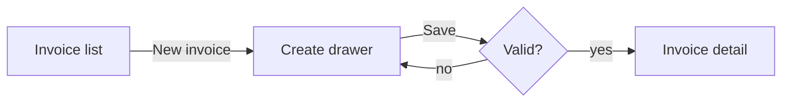

# Teardown template

One teardown file per module per product per run: `research/teardown-<product>-<YYYY-MM-DD>.md`. Keep the sections in this order. Leave a section in place with "Not observed" and the reason rather than deleting it. Write quoted UI text exactly as it appears, in quotation marks.

````markdown
# <Module name> teardown: <Product name>

> One or two sentences: what this module is for and the single most important thing learned.

## Summary

- **What it does:** ...
- **Who uses it:** roles and personas seen (from the product, docs or reviews; tag the source)
- **Key screens:** n screens, n states captured
- **Standout UX:** 2 to 4 bullets
- **Biggest weaknesses:** 2 to 4 bullets
- **Thin or blocked areas:** ...

## Access and method

| | |
|---|---|
| Product | name, URL |
| Mode | own product / reference product / competitor study |
| Source type | web / SaaS / Figma / native mobile (public research + user captures) |
| Account | none / test account on <plan> (never the credentials) |
| Date | YYYY-MM-DD |
| Viewport | desktop, <width>x<height> from `elements.zsh` page.viewport |
| Tools | Orca browser (`shot.zsh`, `elements.zsh`, `orca snapshot`), Figma connector, web search |

## Screen inventory

| # | Screen | Route / frame | States captured | Screenshots |
|---|---|---|---|---|
| 1 | Invoice list | `/invoices` | default, empty, filtered, loading | [default](screenshots/...jpg), [empty](screenshots/...jpg) |

If the module is a single screen, use one row per route or state instead, so no cell grows into a paragraph.

## Screen elements

One `###` subsection per screen, in the order of the inventory. The aim: a designer could rebuild the page from this alone.

### 1. <Screen name>

`<route or frame>`. Page title: "<document title>". Screenshots: [default](screenshots/...jpg), [empty](screenshots/...jpg)

**Purpose:** one line.

**Layout:** regions top to bottom, left to right (header, sidebar, main, right panel, footer), what sits in each, sticky or fixed parts. Structure only, no colours or fonts.

**Headings**
- H1 "..."
  - H2 "..."
    - H3 "..."

**Copy** (verbatim, grouped by region)
| Region | Text |
|---|---|
| main | "..." |
| empty state | "..." |

**Navigation and links**
| Text | Goes to | Where | Notes |
|---|---|---|---|
| "Invoices" | `/invoices` | sidebar | current page |

**Buttons**
| Label | Kind | Where | Does what | States |
|---|---|---|---|---|
| "New invoice" | primary | page header | opens the create drawer | disabled when ... |
| (icon: kebab) "More actions" | icon | row | opens menu: "Duplicate", "Download PDF", "Delete" | |

Kind is judged from the screenshot and `classHint`: primary, secondary, tertiary/ghost, destructive, icon, link-styled, split, toggle.

**Forms**

*<Form name or purpose>*. Submits to: <action or what happens>. Actions: "Save" (primary), "Cancel".

| Field label | Control | Placeholder | Default | Required | Options / range | Validation and messages | Help text |
|---|---|---|---|---|---|---|---|
| "Customer" | combobox (search) | "Search customers" | empty | yes | from customer list | "Customer is required" | |
| "Due date" | date | | today + 30 days | yes | not before issue date | "Due date must be after issue date" | |
| "Notes" | textarea | "Add a note" | | no | max 500 chars | counter "0/500" | "Visible to customer" |

Control is one of: text, email, password, number, tel, url, search, textarea, select, combobox, multi-select, checkbox, checkbox group, radio group, toggle/switch, date, time, date range, file upload, slider, rich text, colour, rating, or a custom one (describe it).

**Data displays**
- Table "<caption>": columns "...", "...". Sortable by ... Filters: ... Pagination: ... Row actions: ... Bulk actions: ... Rows seen: n.
- Cards / list items: the fields shown on each, the order, and the badges.
- Charts: type, metric, time range control.

**Media and icons**: images with alt text and purpose, plus meaningful icons and what they mean.

**Overlays**: for each modal, drawer, menu, popover or tooltip, give the trigger, the title, the contents (with its own fields and buttons, in the same tables) and how it closes.

**States**
| State | How to reach it | What changes | Screenshot |
|---|---|---|---|
| empty | new account, no records | illustration + "No invoices yet" + "Create your first invoice" button | [link](screenshots/...jpg) |
| validation error | submit with Customer empty | inline red message under field, focus moves to first error | [link](screenshots/...jpg) |

## Functionality

- **Features**: what the module can do, as a list of capabilities
- **Business rules**: calculations, limits, defaults, what is automatic
- **Roles and permissions**: who can see or do what (what was observed vs what the docs say)
- **Plan gating**: features behind upgrades, and the upsell copy shown
- **Data objects**: the objects this module creates or shows, with their fields and statuses (for example Invoice: number, customer, amount, status draft/sent/paid/overdue)
- **Integrations and exports**: imports, exports, webhooks, connected apps
- **Notifications**: emails, in-app notifications, reminders it triggers (from what was seen or the docs)

## User flows

One Mermaid diagram per main task (create, edit, find, complete, recover from an error), using the real screen and button names.



## UX analysis

- **Navigation and IA**: how you reach the module, how deep it goes, wayfinding (breadcrumbs, back, tabs)
- **Patterns and components**: tables vs cards, drawers vs pages, inline edit, bulk actions, search and filter patterns
- **Copy and tone**: voice, clarity, consistency, jargon
- **Feedback**: loading, empty, error and success handling; undo; confirmations
- **Efficiency**: clicks to complete key tasks, keyboard shortcuts, defaults and smart suggestions
- **Accessibility observations**: labels missing (from `elements.zsh`), icon-only buttons without names, focus handling, images without alt
- **Strengths**: bullets
- **Weaknesses and friction**: bullets, each tied to a screen

## Edge cases observed

Long text, many records, zero records, permissions denied, timeouts, duplicates, what happens on refresh or back.

## Outside findings

What docs, the changelog, reviews and videos add. Every bullet carries a citation and a tag:

- Bulk invoice sending is limited to 50 at a time ([help centre](https://...)) *confirmed*
- Users complain reminders can't be customised ([G2 review](https://...)) *unverified*

## How others do it

Only when the module was thin and competitors were studied. One `###` per competitor:

### <Competitor name>

- **What it is / URL / date studied**
- **How it handles this job**: a short narrative
- **Screen inventory and screen elements**: the same tables as above, for each screen studied
- **Better than the main product at**: ...
- **Worse at**: ...
- **Ideas worth borrowing**: ...

Then finish with a comparison table across all products studied for the module's key capabilities.

## Gaps and open questions

| Gap or question | Why it is open | Suggested next step |
|---|---|---|

## Sources

- Product pages visited (URLs)
- Docs, reviews, videos and articles, each as a bulleted link with a short description
- Captures supplied by the user (file names)
````
