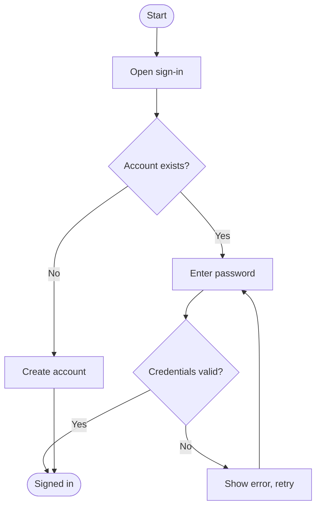
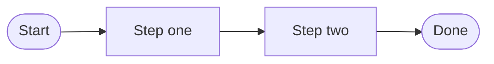
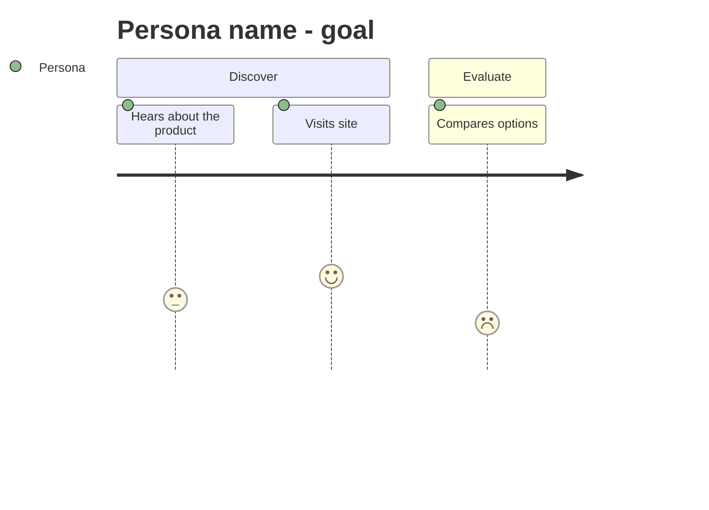

# UX Visualization Guide

The default standard for choosing and shaping UX artifacts. The `ux-visualization-assistant` skill follows it when the project has no guide of its own at `project-management/research/internal/product-knowledge/ux-research/ux-visualization-guide.md`; a project's own guide always wins. Where the guide and a request conflict, the conflict gets surfaced rather than silently resolved.

## Quick-decision table

Match the goal to one artifact. Pick the row whose "Use when" matches the actual question being asked.

| Goal | Artifact | Shape |
| --- | --- | --- |
| Show the happy path through a task, no branching | **Task Flow** | Mermaid `flowchart LR` |
| Show a path with decisions, errors, or alternates | **User Flow** | Mermaid `flowchart TD` |
| Show one persona's experience of our product over time, with emotion | **User Journey** | Mermaid `journey` + phase matrix |
| Show generic behavior in a problem space, product-free | **Experience Map** | Phase matrix table |
| Show how content is grouped and labelled | **Information Architecture** | Mermaid `flowchart TD` tree |
| Show concrete screens and the links between them | **Sitemap** | Mermaid `flowchart TD` tree |
| Capture a reusable user archetype | **Persona** | Card (table + short narrative) |
| Synthesize one segment from fresh research | **Empathy Map** | 4-quadrant table |
| Compare us against competitors | **Competitive Analysis** | Feature matrix table |

## Distinguishing the lookalikes

These four pairs cause almost every mis-pick. Apply the test, do not guess.

**Task Flow vs User Flow** - Count the decision points. Zero decisions means task flow. Any "what if", branch, or error state means user flow. A task flow that grows a diamond has become a user flow; convert it rather than bending the notation.

**User Journey vs Experience Map** - Ask whether our product is in the picture. Tied to our product and a specific named persona means journey. Generic, product-free behavior across a whole problem space means experience map.

**Sitemap vs Information Architecture** - Ask what the nodes are. Concrete screens and the navigation between them means sitemap. Grouping concepts and their labels means IA. IA answers "what do we call this and what lives under it"; a sitemap answers "what screens exist and how do you get between them".

**Persona vs Empathy Map** - Ask about reuse. A durable archetype the team refers back to means persona. Synthesizing one segment from a specific round of fresh research means empathy map.

When genuinely ambiguous, ask exactly one clarifying question, then proceed.

## Notation standards

### Flowcharts

- Rounded nodes `([Start])` for start and end states.
- Rectangles `[Screen or action]` for screens and actions.
- Diamonds `{Decision?}` for decision points.
- **Label every branch.** An unlabelled edge out of a diamond is a defect.
- **Always include the error or empty path** in a user flow. A flow with only the happy path is a task flow wearing the wrong label.

### Task flow

`flowchart LR`, linear, no diamonds.

### Trees (IA and sitemap)

`flowchart TD`, strict hierarchy, no cross-links. If cross-links are essential, it is a user flow, not a tree.

### User journey

Mermaid `journey` for the emotion arc, paired with a phase matrix table when detail is needed.

### Matrices and quadrants

Always markdown tables, never Mermaid. Empathy map is four quadrants (Says / Thinks / Does / Feels). Competitive analysis is a feature matrix with a consistent feature list down the side and yes / partial / no marks.

## Rules

- **One artifact per goal.** If several are needed, generate them separately.
- **Never force the wrong shape.** Matrices and quadrants stay tables; flows and hierarchies stay Mermaid.
- **Lead with the recommendation.** State which artifact and a one-line why before the diagram.
- **Renders with no setup.** A single fenced `mermaid` block or one markdown table, readable on GitHub and in VS Code.
- **Small and correct beats elaborate.** Expand only when asked.
- **Never invent product facts.** Personas, features, and flows come from research or the user. Flag gaps rather than filling them.

## Placement and naming

Generated artifacts go in the routing-correct folder and follow kebab-case and the dating/versioning conventions in the project's `project-management/rules/file-naming-rule.md` (`rules/file-naming-rule.md` in an older workspace), where it has one.

| Artifact | Location |
| --- | --- |
| Module user flows | `project-management/research/internal/product-knowledge/modules/<module>/userflows.md` |
| Information architecture | `project-management/research/internal/product-knowledge/information-architecture.md` |
| Sitemap | `project-management/research/internal/product-knowledge/sitemap.md` |
| Personas | `project-management/research/internal/product-knowledge/user-personas/` |
| Empathy maps, journeys, experience maps | `project-management/research/internal/product-knowledge/ux-research/` |
| Competitive analysis | `project-management/research/external/competitor-analysis/` |

An older workspace keeps `research/` at the project root; there, read these paths without the `project-management/` prefix.
